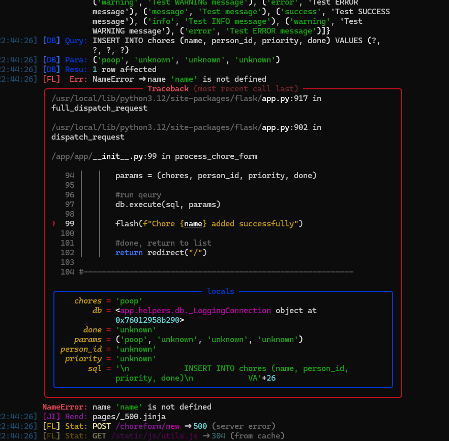
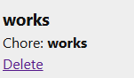
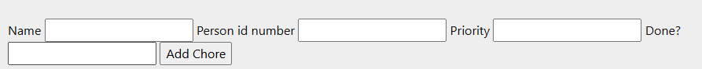
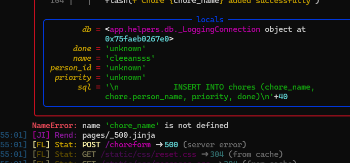

# Sprint 3 - Developing a Minimum Viable Product (MVP)

## Sprint Goals

Continue to develop the web application to the point that it provides all key functionality of the system. Test and refine it so that it can serve as the basis for the final phase of development.

### Specific Goals

**Edit these goals as needed**

- Create the following web pages:
    - Form for ...
    - Etc.
- Develop SQL database queries to:
    - Add a new ...
    - Etc.

## Testing getting my chores to show

I am running my app over and over to find the errors

### Changes / Improvements

I fixed up the names and was able to add in a new chore

## Testing deleting chores

I am testing to see if deleting a chore will work

### Changes / Improvements

Replace this text with notes any improvements you made as a result of the testing.

**PLACE SCREENSHOTS AND/OR ANIMATED GIFS OF THE IMPROVED SYSTEM HERE**

## Testing to get the chores to add via form

I am testing the terminal and app to get the chores to add into the form after getting people names to read. 

### Changes / Improvements

Replace this text with notes any improvements you made as a result of the testing.

**PLACE SCREENSHOTS AND/OR ANIMATED GIFS OF THE IMPROVED SYSTEM HERE**

## ETC...

## Sprint Review

Replace this text with a statement about how the sprint has moved the project forward - key success point, any things that didn't go so well, etc.

